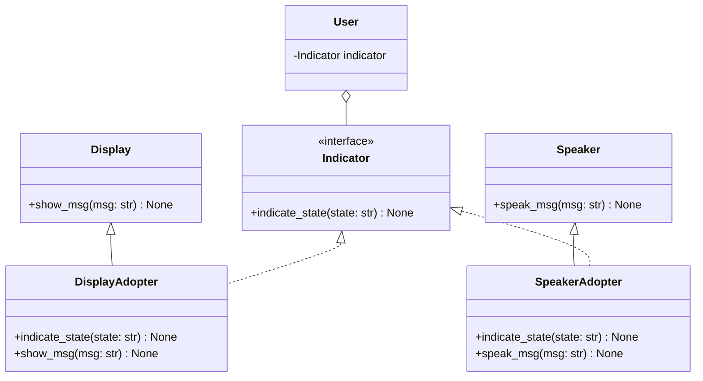

# 02_Adopter pattern

## class

```mermaid
classDiagram

class User{
  -Indicator indicator
}

User o-- Indicator

class Indicator{
  <<interface>>
  +indicate_state(state: str) None
}

class Display{
  +show_msg(msg: str) None
}


class Speaker{
  +speak_msg(msg: str) None
}

Display <|-- DisplayAdopter
Indicator <|.. DisplayAdopter

class DisplayAdopter{
  +indicate_state(state: str) None
  +show_msg(msg: str) None
}


Speaker <|-- SpeakerAdopter
Indicator <|.. SpeakerAdopter

class SpeakerAdopter{
  +indicate_state(state: str) None
  +speak_msg(msg: str) None
}

```
