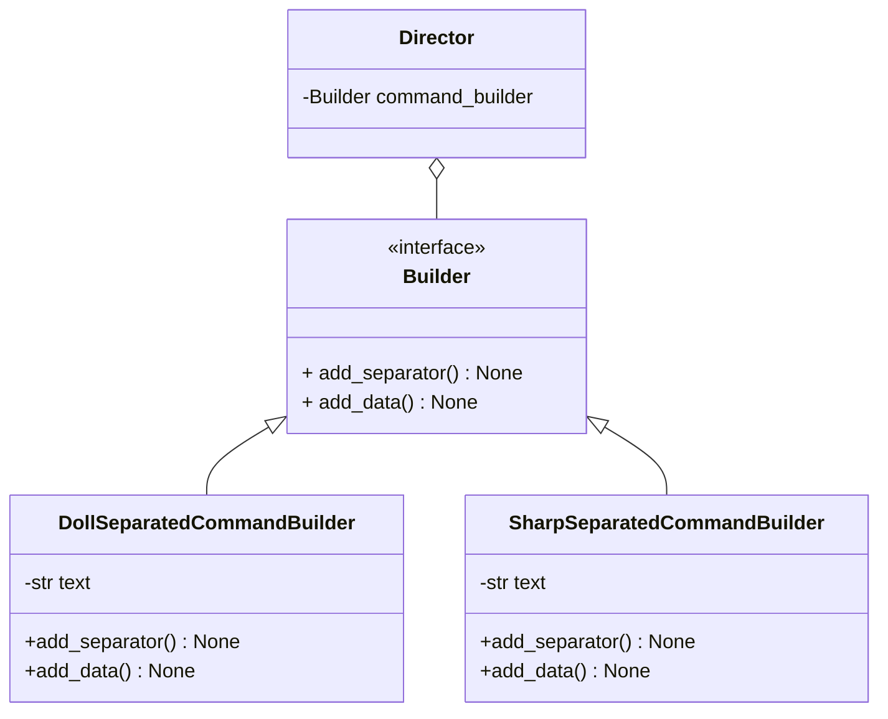

# 19_State pattern

## class

```mermaid
classDiagram

class Builder{
  <<interface>>
  + add_separator() None
  + add_data() None
}

Builder <|-- DollSeparatedCommandBuilder
class DollSeparatedCommandBuilder{
  -str text
  +add_separator() None
  +add_data() None
}

Builder <|-- SharpSeparatedCommandBuilder
class SharpSeparatedCommandBuilder{
  -str text
  +add_separator() None
  +add_data() None
}

Director o-- Builder
class Director{
  -Builder command_builder
}


```
