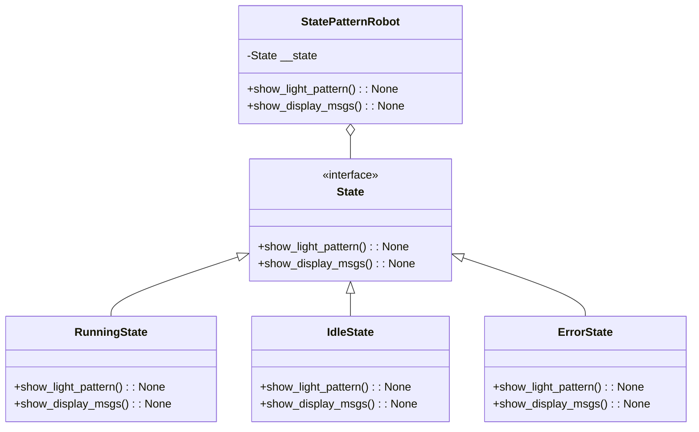

# 19_State pattern

## class

```mermaid
classDiagram
class StatePatternRobot{
  -State __state
  +show_light_pattern(): None
  +show_display_msgs(): None
}

class State{
  <<interface>>
  +show_light_pattern(): None
  +show_display_msgs(): None
}

class IdleState{
  +show_light_pattern(): None
  +show_display_msgs(): None
}

class ErrorState{
  +show_light_pattern(): None
  +show_display_msgs(): None
}

class RunningState{
  +show_light_pattern(): None
  +show_display_msgs(): None
}

StatePatternRobot o-- State
State <|-- RunningState
State <|-- IdleState
State <|-- ErrorState
```
