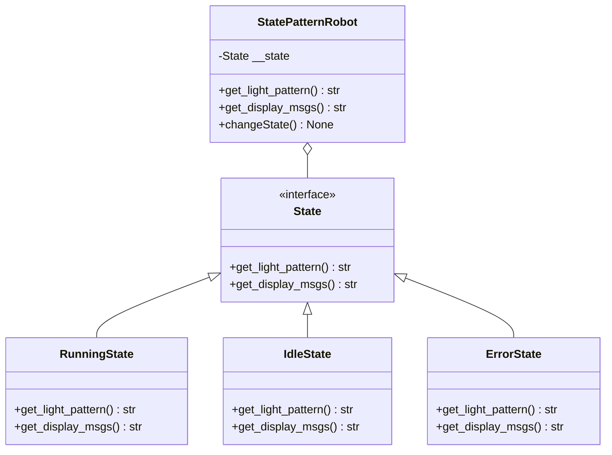

# 19_State pattern

## class

```mermaid
classDiagram
class StatePatternRobot{
  -State __state
  +get_light_pattern() str
  +get_display_msgs() str
  +changeState() None
}

class State{
  <<interface>>
  +get_light_pattern() str
  +get_display_msgs() str
}

class IdleState{
  +get_light_pattern() str
  +get_display_msgs() str
}

class ErrorState{
  +get_light_pattern() str
  +get_display_msgs() str
}

class RunningState{
  +get_light_pattern() str
  +get_display_msgs() str
}

StatePatternRobot o-- State
State <|-- RunningState
State <|-- IdleState
State <|-- ErrorState
```
